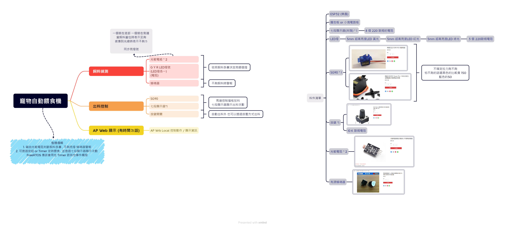
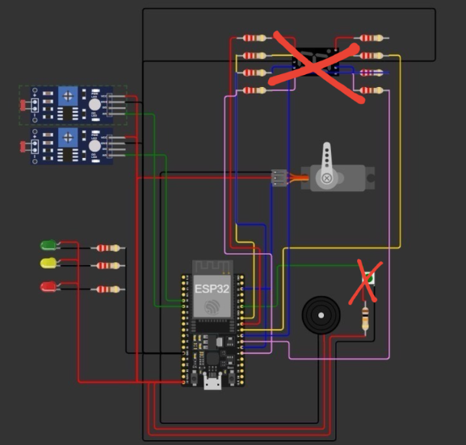
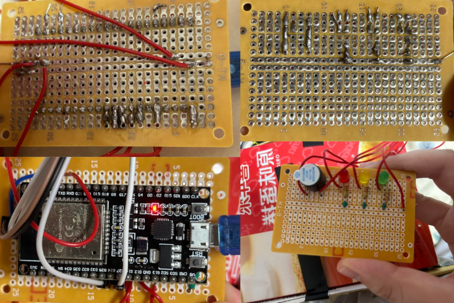
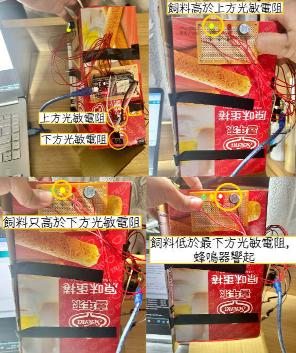

# 寵物自動餵食機｜原始專案封存

**Automatic Pet Feeder — Original Project Archive**

這是我在大同大學化學工程與生物科技學系就讀期間完成的早期實作專案。當時還沒有使用 GitHub 管理作品，因此這個 Repository 是後來找回原始資料後，將當年的程式與設計紀錄重新整理上傳的**歷史封存**，不是近期重新撰寫的版本。

這個作品對我有特別的意義：它是我從生物與化工背景開始接觸程式設計、控制邏輯及硬體整合的經驗之一，也成為後來決定轉入資訊工程領域的契機。

> **關於原始性**：這份專案的程式是當年製作時留下的檔案；依我的實際開發經歷，當時沒有使用生成式 AI 協助撰寫。此次上傳僅補充 README 與整理檔案位置，未修改 `PETCODE/` 中的原始程式。GitHub 上傳日期並不代表程式的原始創作日期。



## 專案內容

這是一套以 **ESP32** 為核心的寵物餵食裝置，將飼料狀態偵測與出料控制整合在同一套系統中。

- **自動與手動出料**：程式使用計時器中斷設定自動觸發，也能透過實體按鈕操作 SG90 伺服馬達開關出料機構。
- **飼料狀態偵測**：兩組光敏感測器讀取不同高度的明暗狀態，以門檻值判斷飼料量狀態。
- **即時提示**：使用紅、黃、綠 LED 表示不同狀態；在判定飼料不足時啟動蜂鳴器。
- **出料次數顯示**：七段顯示器記錄並顯示出料次數（程式以 0–9 循環）。

當時的心智圖也規劃了 AP Web 顯示與控制介面；**目前封存的原始程式未包含完整網頁實作**，因此這部分列為當年的設計規劃，而不當成已完成的功能。

## 實作照片與測試紀錄

以下為當年製作時留下的接線示意、實體電路板與飼料偵測測試照片。這些影像是原始開發紀錄，並非重新繪製的成品展示。

### 1. ESP32 接線示意



接線圖呈現 ESP32 與光敏感測器、伺服馬達、LED、蜂鳴器等元件的連接規劃。**圖中的紅色叉號為原圖註記**，表示有部分電路或元件配置被劃除；因此這張圖應視為開發過程的接線參考，而不是最終完整電路圖。

### 2. 電路板焊接與實體組裝



保留洞洞板正反面焊接、ESP32 安裝及 LED／蜂鳴器接線的照片，記錄從接線規劃到實體組裝的過程。

### 3. 飼料高度偵測測試



利用上下兩處光敏感測器，觀察不同飼料高度時的感測狀態。照片中包含飼料高於上方感測位置、介於上下感測位置，以及低於下方感測位置時的測試與警示紀錄。這些照片反映當時的實作測試，**不代表經過標準化量測的準確率驗證**。

---

## 使用元件與技術

ESP32、Arduino Framework（C/C++）、SG90 Servo、光敏感測模組 ×2、七段顯示器、按鈕、LED、蜂鳴器、硬體中斷、計時器與類比輸入。

## 原始檔案

```text
PETCODE/
  PETCODE.ino
  Feed_Detection.cpp
  Feed_Detection.h
  Motor_controller.cpp
  Motor_controller.h
docs/
  system-overview.png
  wiring-diagram.png
  prototype-circuit-board.png
  feed-level-testing.png
  original-mindmap.xmind
README.md
```

`PETCODE.ino` 是主程式；`Feed_Detection` 負責感測、LED 與蜂鳴器；`Motor_controller` 負責馬達、七段顯示器與按鈕。心智圖保留當年的設計規劃與用料紀錄。

## 封存狀態與注意事項

這份程式碼是**歷史原檔**，並未以目前的 Arduino IDE / ESP32 開發板套件進行重新編譯或實機驗證。檢視時發現 `Motor_controller.cpp` 可能包含重複宣告，以及不屬於正常 C++ 程式的檔名文字；為保留原貌，本次沒有直接更動原始碼。若要重新使用，需先釐清這些問題，以及 ESP32 timer API 與板卡版本的相容性。

原 ZIP 中另有舊版 Arduino IDE Windows 安裝程式，為避免公開散布大型第三方安裝檔，此 Repository 未收錄它；此刪除**不涉及專案原始程式碼**。

## 從這個專案到資訊工程

回頭看這個作品，最重要的不是功能有多複雜，而是我第一次比較完整地思考：感測器讀到什麼、程式如何判斷、控制器又該怎麼回應。也因為這次實作，我開始對軟硬體如何一起運作產生更大的興趣，後來選擇轉學至長庚大學資訊工程學系。

更多研究、專題與課程作品：[Academic Research Portfolio](https://github.com/lin-jessic/academic-research-portfolio)。
